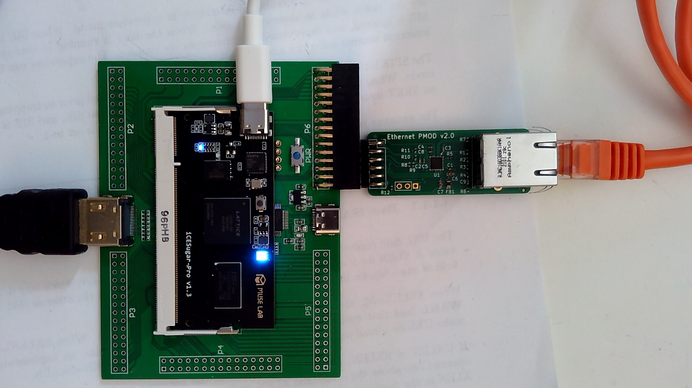

# Setting up the FPGA development board

IMPORTANT: The USB and HDMI connectors on the FPGA board and the breakout board are surface-mount.
Avoid using excess force when plugging cables in.  Consider holding the connector steady with one
hand while plugging in a cable.

IMPORTANT: Be careful not to zap the board with static electricity.  

IMPORTANT: Use the USB connector on the SODIMM sized module, not on the breakout board.



# Installing the Ethernet PMOD

Consult the above image for the proper installation location.  You'll need to solder down
the header at P6.  The FPGA bitstream is configured to support the Ethernet PMOD as installed
aligned with the left side of this header (again, as illustrated above).  Installing it
incorrectly could short power and ground and possibly damage the PMOD or the FPGA board.

## Install Tools

You need the `sconsole` utility -- a very simple serial terminal that also knows how to download
code to the bootloader running on the CPU on the FPGA.

```
$ git clone https://github.com/swetland/sconsole.git
$ cd sconsole
$ make
```

## Updating the FPGA bitstream

The FPGA's "code" is stored in a flash memory on the module.

The USB debug interface exposes a serial port (typically `/dev/ttyACM0`) and
a USB Mass Storage Device with a FAT partition.

You can copy an appropriate `fpga.bit` file to the FAT partition to update the FPGA.

The latest bitstream is in this repository at `prebuilt/fpga.bit.gz` -- it needs to
be decompressed with gzip into `fpga.bit` before installation.

## Booting the FPGA from micro sdcard

If a micro sdcard with a FAT filesystem is installed (in the socket in the underside
of the FPGA board) and there is a `boot.bin` file, that file will be copied to 0x40000000
and executed after the BIOS initializes the hardware.

## Building the FPGA bitstream from scratch

This is complicated. TBD.

## Using sconsole to run software on the FPGA

To just talk to something over the serial port, you can run sconsole like this:
```
$ sconsole -t /dev/ttyACM0 1000000
```
Which will connect to the specified serial port at 1Mbps

The `-t` option allows non-printable characters through (so the ANSI escape
sequences the Litex BIOS uses display properly).  By default sconsole maps
non-printables to `.` to avoid messing up your terminal if there's a burst
of noise on the serial line.

To exit sconsole hit `ESC` twice and then `x` at the prompt.

If you run sconsole against the FPGA module serial port and reset it
(push the button on the module), you should see the Litex BIOS start up:
```
        __   _ __      _  __
       / /  (_) /____ | |/_/
      / /__/ / __/ -_)>  <
     /____/_/\__/\__/_/|_|
   Build your hardware, easily!

 (c) Copyright 2012-2022 Enjoy-Digital
 (c) Copyright 2007-2015 M-Labs

 BIOS built on May  7 2022 13:34:42
 BIOS CRC passed (a41aa094)

 LiteX git sha1: 4694916e

--=============== SoC ==================--
CPU:            VexRiscv_Linux @ 50MHz
BUS:            WISHBONE 32-bit @ 4GiB
CSR:            32-bit data
ROM:            128KiB
SRAM:           8KiB
FLASH:          32768KiB
SDRAM:          32768KiB 16-bit @ 50MT/s (CL-2 CWL-2)

--========== Initialization ============--
Initializing SDRAM @0x40000000...
Switching SDRAM to software control.
Switching SDRAM to hardware control.
Memtest at 0x40000000 (2.0MiB)...
  Write: 0x40000000-0x40200000 2.0MiB     
   Read: 0x40000000-0x40200000 2.0MiB     
Memtest OK
Memspeed at 0x40000000 (Sequential, 2.0MiB)...
  Write speed: 20.4MiB/s
   Read speed: 10.8MiB/s                                                                                                 ...
                                                                                                                         ...
Initializing W25Q256 SPI Flash @0x02000000...                                                                            ...
Enabling Quad mode...
SPI Flash clk configured to 25 MHz
Memspeed at 0x2000000 (Sequential, 4.0KiB)...
   Read speed: 2.4MiB/s
Memspeed at 0x2000000 (Random, 4.0KiB)...
   Read speed: 1.4MiB/s

--============== Boot ==================--
Booting from serial...
Press Q or ESC to abort boot completely.
sL5DdSMmkekro
Timeout
Booting from SDCard in SPI-Mode...
Booting from boot.json...
Booting from boot.bin...
SDCard boot failed.
No boot medium found

--============= Console ================--

litex>
```

You can type `help` at this console and see commands to read/write memory, etc.

For example, `mem_write 0xf0001000 5` will turn the module LED blue.

If you want to run a program on the FPGA board, you need to tell sconsole about it:
```
$ sconsole -t -b/stuff/os-workshop/out/boot.bin@0x40000000 -b/stuff/os-workshop/out/mandelbrot-fb.bin@0x40008000 /dev/ttyACM0 1000000
```
This tells sconsole that if it sees the "start serial download" handshake from the
board to first send `boot.bin` down to memory at 0x40000000 (the start of SDRAM) and
then send `mandelbrot-fb.bin` to 0x40008000 (where the workshop bootloader will transfer
control when it's done) and start executing `boot.bin`.

If the board is already running you can type `serialboot` to kick this process off.

When the board is reset, it will automatically send the download handshake as well.

```
litex> serialboot
Booting from serial...
Press Q or ESC to abort boot completely.
sL5DdSMmkekro
[ serial boot requested ]

[ sending '/stuff/os-workshop/out/boot.bin' to 0x40000000 ]
KKKKKKKKKKKKKKKKKKKKKKKKKKKKKKKKKKKKKKKKKKKKKKKKKKKKKKKKKKKKKKKKKKKK
[ sending '/stuff/os-workshop/out/mandelbrot-fb.bin' to 0x40008000 ]
KKKKKKKKKKK
[ jump to 0x40000000 ]
KExecuting booted program at 0x40000000

--============= Liftoff! ===============--

** Frobozz Magic Bootloader v0.2 **

SVC ENTRY @0x40008000

Hello, Mandelbrot!
```

The messages in square brackets are sconsole telling you what it's done.
The messages after the "Liftoff!" banner are from `boot.bin` and `mandelbrot-fb.bin`

## Network Booting 

Install the Ethernet PMOD.

Ensure the FPGA board and your development computer are on the same local link -- either
using a direct cable between their ethernet ports or both plugged into the same switch.

Run the network boot binary on the FPGA board -- either by copying `out/boot.net.bin` to
`boot.bin` on a FAT partition on a micro sdcard installed in the FPGA board, or by using
serial boot to run it on startup, like so:

```
$ sconsole -t -b/stuff/os-workshop/out/boot.net.bin@0x40000000 /dev/ttyACM0 1000000
```

Use the netboot agent to send your app down over the network:
```
$ out/netboot -i enx000ec66b9271 out/mandelbrot-fb.bin@40008000
```

(use the name of your local ethernet interface as the argument to the `-i` option)
